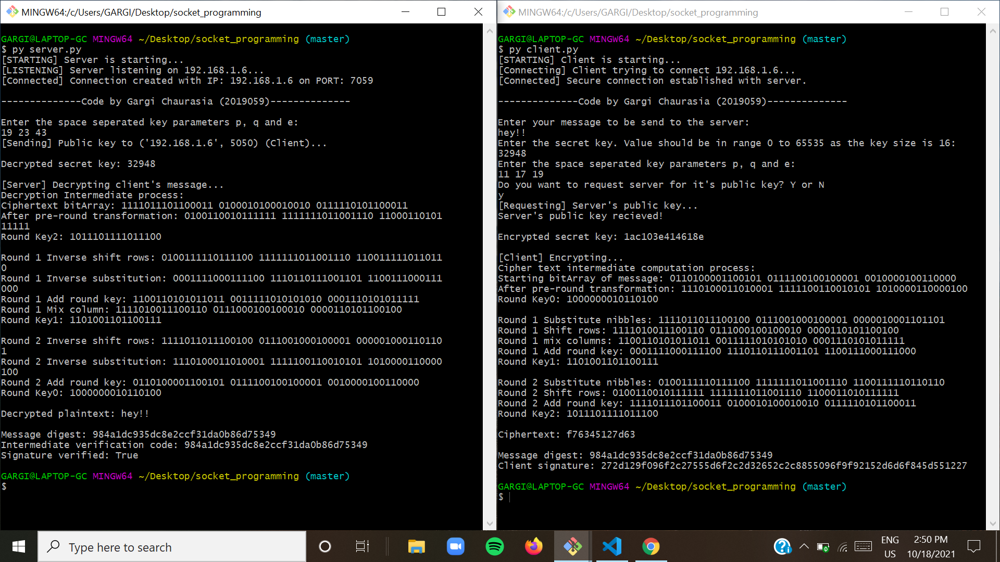

<h1 align=center>CS3006 - Network Security & Cryptography Assignment</h1>

## Table of Contents

1. [Overview](#overview)
2. [Prerequisits](#prerequisits)
3. [File structure](#file-structure)
4. [Implementation](#implementation)
5. [Code Execution](#code-execution)
6. [Sample Output](#sample-output)

## Overview

A client-server application with confidential message exchange to provide authentication, integrity and key sharing among both the client and server with the help of RSA and Simplified AES algorithm.

## Prerequisits

The code execution requires [python 3.x](https://www.python.org/) version installed on the system.

## File Structure

This repository consists of 2 files and 1 package which consists of 4 modules.

1. Util Package

   - _This utitlity package contains all the required files for performing entire encryption and decryption._

   - **The modules are:**

     - [RSA.py](#RSA.py)
     - [SAES.py](#saes.py)
     - [HashAlgo.py](#hashalgo.py)
     - [Operations.py](#operations.py)

2. [server.py](#server.py)

   - _This file is for server side communication & decryption algorithm implementation_

3. [client.py](#client.py)
   - _This file is for client side communication & encryption algorithm implementation_

## Implementation

### RSA.py

_RSA class for generating private and public key and rsa encryption and decryption algorithm_

- **Imports**

  - `Operations` class object from `util.Operations`

- **Class methods**
  - `verifyParameters()`: Verify p and q as primes and e as valid number, returns bool
  - `generateKeys()`: Generates public and private key if key parameters are validated else exits the program
  - `encrypt()`: Encrypts the plaintext with private key and return the ciphertext list
  - `decrypt()`: Decrypts the ciphertext with public key and returns the decrypted plaintext
  - `sign()`: Generates the client signature using client's private key and provided message digest
  - `verify()`: Decrypts the client signature using client's public key and verifies if generated message digest and decrypted client signature matches
  - `printHexList()`: Converts the ciphertext list into hex form

### SAES.py

_SAES class for generating subkeys and simplified aes encryption and decryption algorithm of the user's input message_

- **Imports**

  - `Operations` class object from `util.Operations`

- **Class Methods**
  - `__perform_substitution()`: Returns substitued value after nibble substitution (S-Boxes) from the given substitution box
  - `generate_subkeys()`: Generating subkeys from the given secret key - 16 bit int in the range of (1, 2^16-1)
  - `__initial_round()`: Adds round key implementation before round 1
  - `__convert_into_matrix()`: Converts the plaintext blocks list into matrix form (plaintext block (pair wise blocks of the entire text e.g ok!! => ['ok', '!!']))
  - `__perform_encryption_round()`: Performs 2 round of encryption by substituting nibbles, shifting rows, mixing columns if it is not the last round and then adding round key
  - `encrypt()`: Method which is externally called to intiate the encryption process. This method calls the `__initial_round()`, `__convert_into_matrix()` and `__perform_encryption_round()` methods to encrypt the given plaintext
  - `__perform_decryption_round()`: Performs 2 round of decryption by inverse shifting rows, Inverse Substitution,adding round key and then inverse mixing columns if it is not the last round
  - `decrypt()`: Method which is externally called to intiate the decryption process. This method calls the `__initial_round()`, `__convert_into_matrix()` and `__perform_decryption_round()` methods to decrypt the given ciphertext

### HashAlgo.py

- _HashAlgo class for creating message digest using md5 hash algo_

- **Imports**

  - `hashlib` (Built-in library)

- **Class Methods**
  - `generateHashCode()`: Generates hash code of the given message using md5 hash algorithm

### Operations.py

- _Utitlity module which consists of all the mathematical operations and functions in Operations class used in RSA and SAES modules_

- **Imports**

  - `random` (Built-in library)

- **Class Methods**
  - `isPrime()`: Verifies if the given no is prime
  - `isCoprime()`: Verifies if the givens numbers have their gcd 1
  - `gcd()`: Calculates the gcd of two numbers using Euclidien's algorithm
  - `modInverse()`: Calculates the modular multiplicative inverse of a using modulo m
  - `shift_operation()`: Shifts the bits of the number to the left or right as directed
  - `circular_left_shift()`: Rotates the bits of the given number to the left by the given shift amount

### client.py

- **Imports**

  - `socket`, `pickle`, `RSA`, `SAES`, `HashAlgo`, `Operations`

- **Work flow**
  - Connects with the server
  - Input user's message, secret key, and key parameters p, q and e
  - requests and receives server public key from server (server.py)
  - encrypts secret key
  - encrypts plaintext into a ciphertext
  - computes client signature by hasing message
  - sends ciphertext, client signature, client's public key and ecrypted secret key to the server

### server.py

- **Imports**

  - `socket`, `pickle`, `RSA`, `SAES`, `HashAlgo`, `Operations`

- **Work flow**
  - Connects with the client
  - Input key parameters p, q and e
  - accepts client's request and sends it's public key to client (client.py)
  - recieves ciphertext, client signature, client's public key and ecrypted secret key from the client
  - decrypts secret key
  - decrypts ciphertext into a plaintext
  - computes digital signature by hasing decrypted plaintext
  - verifies client's signature

## Code Execution

First run the server side

> 1. run the server.py file
> 2. Enter the key parameters

> 3. run the client.py file
> 4. Enter message
> 5. Enter secret key
> 6. Enter key parameters
> 7. Type y to send request to the server for it's public key

## Sample Output

